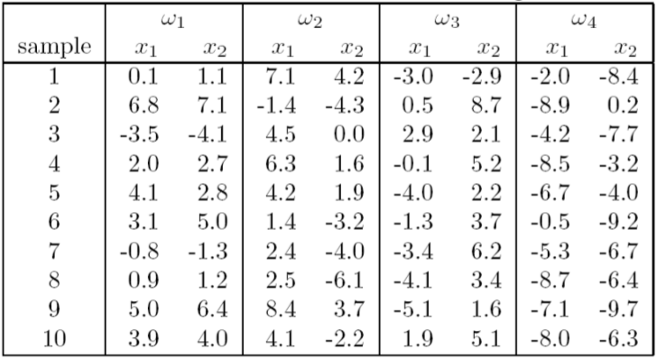
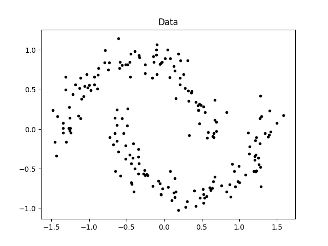

# 模式识别 Pattern Recognition
## 0. 简介
* 模式识别的一些实例问题Python实现
* 环境: Ubuntu16.04 + Python3.6

## 1. 实例问题
### Problem 1
通过下列步骤说明这样一个事实：大量独立的随机变量的平均将近似为一高斯分布。
* 写一个程序，从均一分布$U(x_l,x_u)$中产生n个随机整数。
* 写一个程序，从范围$-100 \le x_l < x_u \le 100$中随机取$x_l$和$x_u$，以及在范围$0<n \le 1000$中随机取n的值。
* 通过上述方式累计产生$10^4$个样本点，并绘制一直方图。
* 计算该直方图的均值和标准差，并绘图。
* 对于$10^5$和$10^6$个样本点分别重复以上步骤，讨论所得结论。

### Problem 2
根据以下步骤测试经验误差：
* 写一个程序产生d维空间的样本点，服从均值为$\mu$和协方差矩阵$\Sigma$的正态分布。
* 考虑正态分布
$$
  p(x|\omega_1) \sim N (\dbinom{1}{0}, I)\\
  p(x|\omega_2) \sim N (\dbinom{-1}{0}, I)
$$

且$P(\omega_1)=P(\omega_2)=0.5$，说明贝叶斯判决边界。
* 产生100个点(50个$\omega_1$类的点，50个$\omega_2$类的点)，并计算经验误差。

### Problem 3

实现批量感知器算法.初始权向量$a = 0$,
* 使用程序利用$\omega_1$和$\omega_2$的数据进行训练,记录收敛步数.
* 使用程序利用$\omega_2$和$\omega_3$的数据进行训练,记录收敛步数.

    

> 本数据同时被问题3/4/5使用

### Problem 4

实现Ho-Kashyap算法,并使用它分别对$\omega_1$和$\omega_3$与$\omega_2$和$\omega_4$进行分类.给出分类误差并分析.

### Problem 5

请写一个程序,实现 MSE 多类扩展方法。每一类用前 8 个样本来构造分类器,用后两个样本作测试。请给出你的正确率.

### Problem 6

本题使用的数据如下:

第一类 10 个样本(三维空间):

[1.58, 2.32, -5.8], [0.67, 1.58, -4.78], [1.04, 1.01, -3.63], [-1.49, 2.18, -3.39], [-0.41, 1.21, -4.73],
[1.39, 3.16, 2.87], [1.20, 1.40, -1.89], [-0.92, 1.44, -3,22], [0.45, 1.33, -4.38], [-0.76, 0.84, -1.96]

第二类 10 个样本(三维空间):

[0.21, 0.03, -2.21], [0.37, 0.28, -1.8], [0.18, 1.22, 0.16], [-0.24, 0.93, -1.01], [-1.18, 0.39, -0.39],
[0.74, 0.96, -1.16], [-0.38, 1.94, -0.48], [0.02, 0.72, -0.17], [ 0.44, 1.31, -0.14], [0.46, 1.49, 0.68]

第三类 10 个样本(三维空间):

[-1.54, 1.17, 0.64], [5.41, 3.45, -1.33], [1.55, 0.99, 2.69], [1.86, 3.19, 1.51], [1.68, 1.79, -0.87],
[3.51, -0.22, -1.39], [1.40, -0.44, -0.92], [0.44, 0.83, 1.97], [ 0.25, 0.68, -0.99], [0.66, -0.45, 0.08]

* 请编写两个通用的三层前向神经网络反向传播算法程序,一个采用批量方式更新权重,另一个采用单样本方式更新权重。其中,隐含层结点的激励函数采用双曲正切函数,输出层的激励函数采用 sigmoid 函数。目标函数采用平方误差准则函数。

* 请利用上面的数据验证你写的程序,分析如下几点:
  * 隐含层不同结点数目对训练精度的影响;
  * 观察不同的梯度更新步长对训练的影响,并给出一些描述或解释;
  * 在网络结构固定的情况下,绘制出目标函数随着迭代步数增加的变化曲线。
  
### Problem 7

现有1000个二维空间的数据点, 其$\sigma=[1,0;0,1]$, $\mu_1=[1,-1],\mu_2=[5.5,-4.5], \mu_3=[1,4], \mu_4=[6,4.5], \mu_5=[9,0]$.
请完成如下工作:

* 编写一个程序, 实现经典的K-means聚类算法;
* 令聚类个数为5, 采用不同的初始值观察最后的聚类中心, 给出你所估计的聚类中心, 指出每个中心有多少个样本; 指出你所得到的聚类中心与对应的真实分布的均值之间的误差(对5个聚类, 给出均方误差即可).

### Problem 8

关于谱聚类。有如下 200 个数据点,它们是通过两个半月形分布生成的。如图所示:

    

* 请编写一个谱聚类算法,实现"Normalized Spectral Clustering—Algorithm 3 (Ng 算法)".
* 设点对亲和性(即边权值)采用如下计算公式:

$$
  w_{ij} = e^{-\frac{||x_i-x_j||^2_2}{2\sigma^2}}
$$

同时,数据图采用 k-近邻方法来生成(即对每个数据点$x_i$,首先在所有样本中找出不包含$x_i$的 k 个最邻近的样本点,然后$x_i$与每个邻近样本点均有一条边相连,从而完成图构造)。

注意,为了保证亲和度矩阵 W 是对称矩阵,可以令$W=\frac{(W^{T} +W)}{2}$. 假设已知前 100 个点为一个聚类, 后 100 个点为一个聚类,请分析分别取不同的$\sigma$值和 k 值对聚类结果的影响。
(本题可以给出关于聚类精度随着$\sigma$值和 k 值的变化曲线。在实验中,可以固定一个,变化另一个).

### Problem 9

从MNIST数据集中选择两类，对其进行SVM分类，可调用现有的SVM工具.
