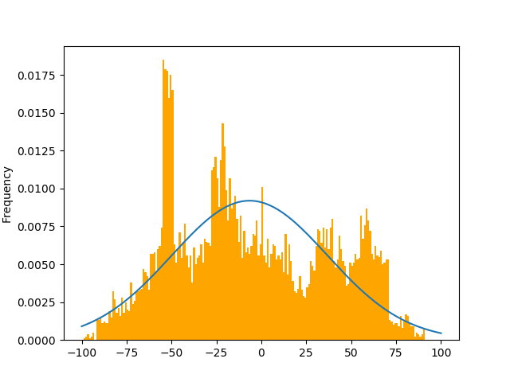
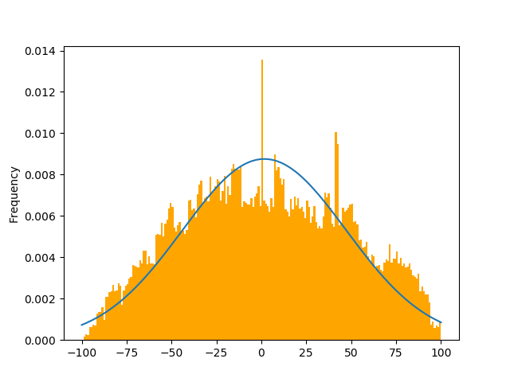
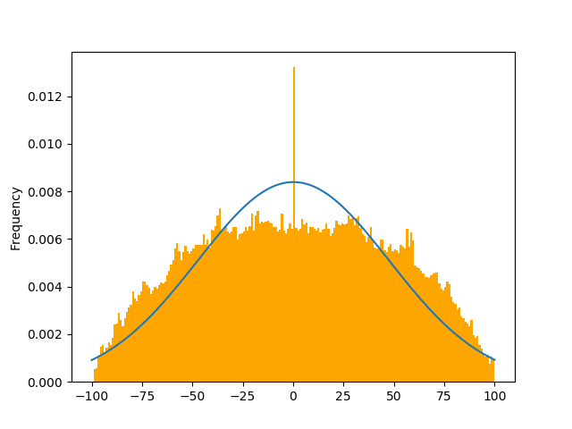

# Problem 1
## 1. 问题描述
通过下列步骤说明这样一个事实：大量独立的随机变量的平均将近似为一高斯分布。
* 写一个程序，从均一分布$U(x_l,x_u)$中产生n个随机整数。
* 写一个程序，从范围$-100 \le x_l < x_u \le 100$中随机取$x_l$和$x_u$，以及在范围$0<n \le 1000$中随机取n的值。
* 通过上述方式累计产生$10^4$个样本点，并绘制一直方图。
* 计算该直方图的均值和标准差，并绘图。
* 对于$10^5$和$10^6$个样本点分别重复以上步骤，讨论所得结论。

## 2. 实现思路
根据题目要求进行循环采样，每轮采样的样本数和采样子区间的上下界均随机确定。为保证采样的样本总数为所要求的定值，在剩余的需采样点个数大于1000时，随机确定该轮采样的样本个数; 当剩余个数小于1000时，一次性采完。另外，在使用numpy的随机函数时，注意到了区间左右界的开闭情况。

## 3. Python代码
```Python
import numpy as np
import matplotlib.pyplot as plt

def normfunc(x,mu,sigma):
    """
    Return a list of value depending on the parameters according to Normal distribution.
    Parameters:
        x: a list of x value
        mu: mean value
        sigma: std
    """
    y = np.exp(-((x - mu)**2)/(2*sigma**2)) / (sigma * np.sqrt(2*np.pi))
    return y

def gen_cal_plot(N):
    """
    i) Generate N samples and plot them.
    ii) Calculate the mean & std and plot.
    Parameters:
        N : the number of the samples
    """
    S = []
    # 当剩余样本数大于1000时随机确定此轮采样样本个数n
    while N >= 1000:
        n = np.random.randint(1,1001)
        N -= n
        # 随机选取此轮采样上下界
        x_l, x_u = np.random.randint(-100, 101, 2)
        if x_l > x_u: x_l, x_u = x_u, x_l
        # 采样
        s = np.array(np.random.uniform(x_l, x_u+1, n), np.int)
        S.extend(s)
    # 当剩余样本数小于1000时，完成最后一轮采样
    if N:
        x_l, x_u = np.random.randint(-100, 101, 2)
        if x_l > x_u: x_l, x_u = x_u, x_l
        s = np.array(np.random.uniform(x_l, x_u+1, N), np.int)
        S.extend(s)
    # 计算均值和标准差
    mean = np.mean(S)
    std = np.std(S)
    # 根据均值标准差计算正态分布曲线
    x = np.arange(-100, 101, 1)
    y = normfunc(x, mean, std)
    # 绘图
    plt.hist(S, bins=200, range=[-100,100], normed=True, color='orange')
    plt.plot(x, y)
    plt.ylabel("Frequency")
    plt.show()

if __name__ == "__main__":
    gen_cal_plot(10000)
    gen_cal_plot(100000)
    gen_cal_plot(1000000)
```

## 4. 结果与讨论

分别采样$10^4$、$10^5$和$10^6$个样本后，其直方图如下，图中曲线为根据均值和标准差绘制的正态分布曲线。

<div align=center>
    
    
    
</div>

对比三个图可以看出，当采样点数为$10^4$时，样本的分布不呈现什么规律。随着样本个数的增多，样本分布逐渐规整：在均值处样本最多，在均值两侧基本对称，这在样本个数为$10^6$时较为明显。