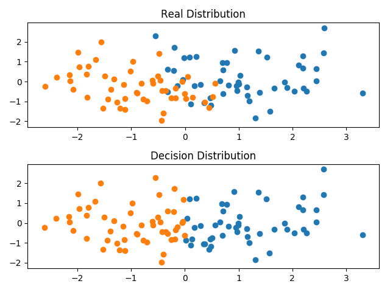

# Problem 2
## 1. 问题描述
根据以下步骤测试经验误差：
* 写一个程序产生d维空间的样本点，服从均值为$\mu$和协方差矩阵$\Sigma$的正态分布。
* 考虑正态分布
$$
  p(x|\omega_1) \sim N (\dbinom{1}{0}, I)\\
  p(x|\omega_2) \sim N (\dbinom{-1}{0}, I)
$$

且$P(\omega_1)=P(\omega_2)=0.5$，说明贝叶斯判决边界。
* 产生100个点(50个$\omega_1$类的点，50个$\omega_2$类的点)，并计算经验误差。

## 2. 实现思路
首先，根据(b)中所给信息计算确定判决边界。

由于$p(x|\omega_1)$和$p(x|\omega_2)$均服从正态分布，且有$P(\omega_1)=P(\omega_2)=0.5$。

因此，贝叶斯判决边界为
$$
  \dbinom{2}{0} \times x = 0
$$

## 3. Python代码
```Python
import numpy as np
import matplotlib.pyplot as plt

def main():
    # 设置参数
    mean_1 = [1, 0]
    mean_2 = [-1, 0]
    cov = np.eye(2)

    # 生成样本点
    s_1 = np.random.multivariate_normal(mean_1, cov, 50)
    s_2 = np.random.multivariate_normal(mean_2, cov, 50)
    
    # 绘制样本点
    x_1 = s_1[:,0]
    y_1 = s_1[:,1]
    x_2 = s_2[:,0]
    y_2 = s_2[:,1]
    plt.subplot(211).set_title("Real Distribution")
    plt.scatter(x_1,y_1)
    plt.scatter(x_2,y_2)

    # 根据贝叶斯判决边界绘制判决结果
    S = []
    S.extend(s_1)
    S.extend(s_2)
    X_1 = []
    Y_1 = []
    X_2 = []
    Y_2 = []
    for i in S:
        if i[0]>0:
            X_1.append(i[0])
            Y_1.append(i[1])
        else:
            X_2.append(i[0])
            Y_2.append(i[1])
    plt.subplot(212).set_title("Decision Distribution")
    plt.scatter(X_1,Y_1)
    plt.scatter(X_2,Y_2)
    plt.tight_layout()
    plt.show()

    # 计算错误率
    err_1 = [i for i in s_1 if i[0]<0]
    err_2 = [i for i in s_2 if i[0]>0]
    err_cnt = len(err_1) + len(err_2)
    rate = err_cnt/100
    print (rate)

if __name__ == "__main__":
    main()
```

## 4. 结果与讨论

两类各采样50个样本点的分布和根据所求的贝叶斯判决边界判决的结果如下图所示。

<div align=center>
    
</div>

经计算，在上述仿真过程中，经验误差为0.15.

