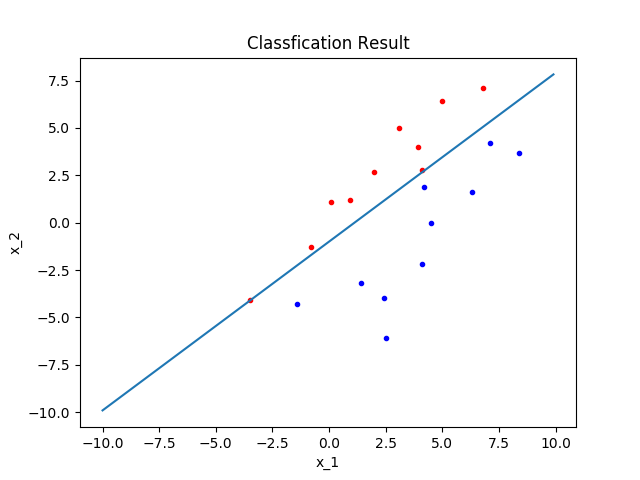
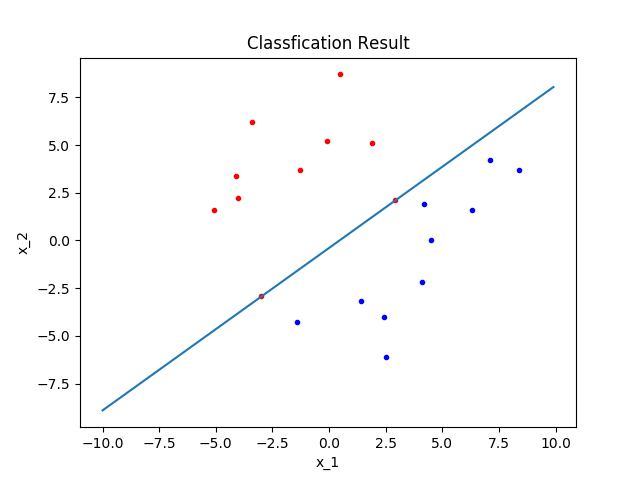

# Problem 3
## 1. 问题描述

实现批量感知器算法.初始权向量$a = 0$,
* 使用程序利用$\omega_1$和$\omega_2$的数据进行训练,记录收敛步数.
* 使用程序利用$\omega_2$和$\omega_3$的数据进行训练,记录收敛步数.

<div align=center>
    
</div>

## 2. 实现思路

* 规范化增广样本
* 初始化参数
* 基于批处理感知算法更新权向量.

## 3. Python代码
### 3.1 规范化增广样本
```Python
import numpy as np
import copy
def samples_trans(w1, w2):
    """
    规范化增广样本
    Parameters:
        w1: 类1样本
        w2: 类2样本
    Return:
        w: 规范化增广样本
    """
    # 复制样本,防止后续操作改变原始样本
    w_1 = copy.deepcopy(w1)
    w_2 = copy.deepcopy(w2)

    # 增广
    for i in w_1: i.append(1)
    for i in w_2: i.append(1)

    # 规范化
    w_1 = np.array(w_1)
    w_2 = np.array(w_2)
    w_2 = -w_2
    w = np.concatenate([w_1, w_2])

    return w
```

### 3.2 批处理感知算法
```Python
def batch_perception(w1, w2):
    """
    Batch Perception
    Parameters:
        w1: 类1样本
        w2: 类2样本
    Return:
        a
        k: 迭代次数
    """
    # 规范化增广样本
    w = samples_trans(w1, w2)

    # 初始化参数
    a = np.zeros_like(w[1])
    yita = 1
    theta = np.zeros_like(w[1])+1e-6
    k = 0

    # 迭代
    while True:
        y = np.zeros_like(w[1])
        for i in w:
            if np.matmul(a.T, i) <= 0:y += i
        yita_y = yita * y

        if all(np.abs(yita_y)<=theta):break

        a += yita_y
        k += 1
    
    return a, k
```

### 3.3 求解(a)(b)
```Python
# (a)
w_1 = [[0.1, 1.1], [6.8, 7.1], [-3.5, -4.1], [2.0, 2.7], [4.1, 2.8], 
      [3.1, 5.0], [-0.8, -1.3], [0.9, 1.2], [5.0, 6.4], [3.9, 4.0]]
w_2 = [[7.1, 4.2], [-1.4, -4.3], [4.5, 0.0], [6.3, 1.6], [4.2, 1.9],
      [1.4, -3.2], [2.4, -4.0], [2.5, -6.1], [8.4, 3.7], [4.1, -2.2]]
a, k = batch_perception(w_1, w_2)
print ("a:{}\nk:{}".format(a, k))

# (b)
w_3 = [[-3.0, -2.9], [0.5, 8.7], [2.9, 2.1], [-0.1, 5.2], [-4.0, 2.2],
      [-1.3, 3.7], [-3.4, 6.2], [-4.1, 3.4], [-5.1, 1.6], [1.9, 5.1]]
a, k = batch_perception(w_3, w_2)
print ("a:{}\nk:{}".format(a, k))
```

## 4. 结果与讨论

对于$\omega_1$和$\omega_2$两类数据,迭代23次,得到权向量$(-30.4, 34.1, 34)^T$

<div align=center>
    
</div>

对于$\omega_2$和$\omega_3$两类数据,迭代16次,得到权向量$(-41.4, 48.6, 19)^T$.

<div align=center>
    
</div>


