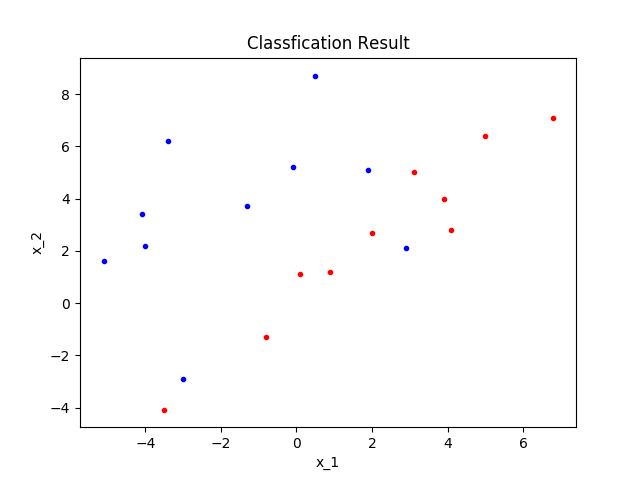
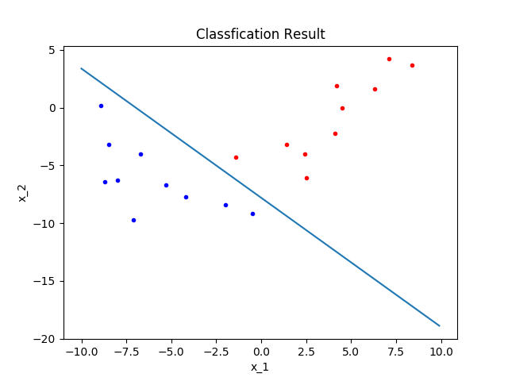

# Problem 4
## 1. 问题描述

实现Ho-Kashyap算法,并使用它分别对$\omega_1$和$\omega_3$与$\omega_2$和$\omega_4$进行分类.给出分类误差并分析.

<div align=center>
    
</div>

## 2. 实现思路

* 规范化增广样本
* 初始化参数
* 基于Ho-Kashyap算法迭代更新a和b.

## 3. Python代码
### 3.1 规范化增广样本
```Python
import numpy as np
import copy
def samples_trans(w1, w2):
    """
    规范化增广样本
    Parameters:
        w1: 类1样本
        w2: 类2样本
    Return:
        w: 规范化增广样本
    """
    # 复制样本,防止后续操作改变原始样本
    w_1 = copy.deepcopy(w1)
    w_2 = copy.deepcopy(w2)

    # 增广
    for i in w_1: i.append(1)
    for i in w_2: i.append(1)

    # 规范化
    w_1 = np.array(w_1)
    w_2 = np.array(w_2)
    w_2 = -w_2
    w = np.concatenate([w_1, w_2])

    return w
```

### 3.2 Ho-Kashyap算法
```Python
def HK_algorithm(w1, w2):
    """
    Ho-Kashyap Algorithm
    Parameters:
        w1: 类1样本
        w2: 类2样本
    Return:
        a, b, k
    """
    # 规范化增广样本
    w = samples_trans(w1, w2)

    # 初始化
    a = np.zeros_like(w[1])
    b = np.zeros(w.shape[0]) + 0.5
    yita = 0.5
    th_b = np.zeros(w.shape[0]) + 1e-3
    th_k = 10000
    k = 1

    # 迭代
    while k <= th_k:
        e = np.matmul(w, a) - b
        e_p = 0.5 * (e + np.abs(e))
        b += 2 * (yita) * e_p
        a = np.matmul(np.matmul(np.linalg.inv(np.matmul(w.T, w)), w.T), b)
        k += 1

        # 判断是否线性不可分
        if any(e) < 0 and any(e) > 0: break

        if all(np.abs(e) <= th_b): return a, e, k
    
    print ("No solution found !", k)
    return None, None, k
```

### 3.3 求解(a)(b)
```Python
w_1 = [[0.1, 1.1], [6.8, 7.1], [-3.5, -4.1], [2.0, 2.7], [4.1, 2.8], 
        [3.1, 5.0], [-0.8, -1.3], [0.9, 1.2], [5.0, 6.4], [3.9, 4.0]]
w_2 = [[7.1, 4.2], [-1.4, -4.3], [4.5, 0.0], [6.3, 1.6], [4.2, 1.9], 
      [1.4, -3.2], [2.4, -4.0], [2.5, -6.1], [8.4, 3.7], [4.1, -2.2]]
w_3 = [[-3.0, -2.9], [0.5, 8.7], [2.9, 2.1], [-0.1, 5.2], [-4.0, 2.2], 
      [-1.3, 3.7], [-3.4, 6.2], [-4.1, 3.4], [-5.1, 1.6], [1.9, 5.1]]
w_4 = [[-2.0, -8.4], [-8.9, 0.2], [-4.2, -7.7], [-8.5, -3.2], [-6.7, -4.0], 
      [-0.5, -9.2], [-5.3, -6.7], [-8.7, -6.4], [-7.1, -9.7], [-8.0, -6.3]]
# (a)
a, b, k = HK_algorithm(w_1, w_3)
print (a, b, k)
show_result(w_1, w_3, a)

# (b)
a, b, k = HK_algorithm(w_2, w_4)
print (a, b, k)
show_result(w_2, w_4, a)
```

## 4. 结果与讨论

利用程序对$\omega_1$和$\omega_3$分类.算法判断此两类线性不可分,为验证其真实情况,做上述两类样本的散点图如下图所示.

<div align=center>
    
</div>

利用程序对$\omega_1$和$\omega_2$分类,迭代得到权向量$a = (0.28705495, 0.25649182, 2.0037991)^T$.此时的误差是

```Python
           [3.67685249e-05  -9.97335486e-04   2.40112701e-05   3.04323559e-05
            2.69355530e-05   1.21333562e-05   1.25869927e-05   8.90828697e-06
            3.83537956e-05   1.91839467e-05   4.01030966e-06  -3.09893675e-04
            6.96252457e-06   6.95894683e-06   4.96249797e-06  -5.49458729e-04
            7.24029286e-06   1.32441658e-05   1.62424168e-05   1.17098451e-05]
```

分类情况如下图所示.

<div align=center>
    
</div>


