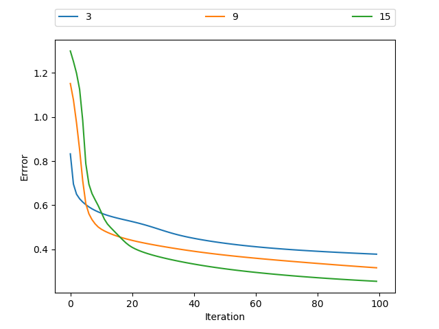
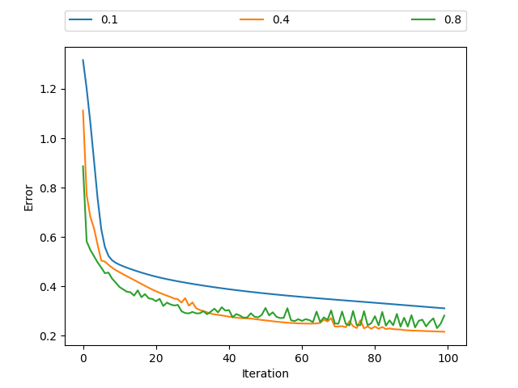
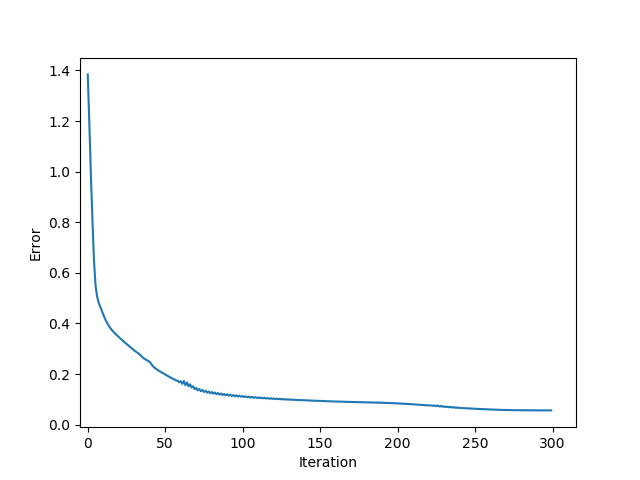
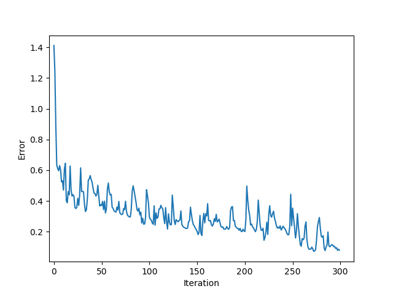

# Problem 6
## 1. 问题描述

本题使用的数据如下:

第一类 10 个样本(三维空间):

[1.58, 2.32, -5.8], [0.67, 1.58, -4.78], [1.04, 1.01, -3.63], [-1.49, 2.18, -3.39], [-0.41, 1.21, -4.73],
[1.39, 3.16, 2.87], [1.20, 1.40, -1.89], [-0.92, 1.44, -3,22], [0.45, 1.33, -4.38], [-0.76, 0.84, -1.96]

第二类 10 个样本(三维空间):

[0.21, 0.03, -2.21], [0.37, 0.28, -1.8], [0.18, 1.22, 0.16], [-0.24, 0.93, -1.01], [-1.18, 0.39, -0.39],
[0.74, 0.96, -1.16], [-0.38, 1.94, -0.48], [0.02, 0.72, -0.17], [ 0.44, 1.31, -0.14], [0.46, 1.49, 0.68]

第三类 10 个样本(三维空间):

[-1.54, 1.17, 0.64], [5.41, 3.45, -1.33], [1.55, 0.99, 2.69], [1.86, 3.19, 1.51], [1.68, 1.79, -0.87],
[3.51, -0.22, -1.39], [1.40, -0.44, -0.92], [0.44, 0.83, 1.97], [ 0.25, 0.68, -0.99], [0.66, -0.45, 0.08]

* 请编写两个通用的三层前向神经网络反向传播算法程序,一个采用批量方式更新权重,另一个采用单样本方式更新权重。其中,隐含层结点的激励函数采用双曲正切函数,输出层的激励函数采用 sigmoid 函数。目标函数采用平方误差准则函数。

* 请利用上面的数据验证你写的程序,分析如下几点:
  * 隐含层不同结点数目对训练精度的影响;
  * 观察不同的梯度更新步长对训练的影响,并给出一些描述或解释;
  * 在网络结构固定的情况下,绘制出目标函数随着迭代步数增加的变化曲线。

## 2. 实现思路

为实现题目中所要求的功能, 需要实现以下子功能:

* 根据题目所提供的输入数据,生成相应的Label, 形成最终的训练数据;

* 初始化三层网络, 其中隐含层结点个数可改变;

* 网络训练: 包括前向传播和反向传播. 包含两种权重矩阵更新方式, 单样本更新方式是指每次得到基于单个样本的权重更新矩阵后, 立即更新权重矩阵; 批量方式更新是指将所有单次得到更新矩阵累加, 在批量数据全部运算完毕后一起更新权重矩阵.

因此, 代码实现时主要分为两部分: 训练数据生成函数和三层网络类. 后者包含网络初始化和训练所需的各个函数.

## 3. Python代码
### 3.1 训练数据生成函数
```Python
import numpy as np
import copy
def gen_train_data(data_input):
    """
    根据输入数据, 生成相应的label, 形成训练数据
    Parameter:
        data_input: 输入数据列表 [[类1数据], [类2数据], [类3数据], ...]
    Return:
        train_data: 训练用数据列表 [[数据1], [数据2], ...]
        train_label: 训练用Label列表 [[数据1对应Label], [数据2对应Label], ...]
    """
    train_data = []
    train_label = []
    for idx, i in enumerate(data_input):
        for j in i:
            # 数据列表
            data = np.array(j)
            train_data.append(data)
            # Label列表: 对应类别为1, 其余为0
            label = np.zeros_like(data)
            label[idx] = 1
            train_label.append(label)
    
    return train_data, train_label
```

### 3.2 三层网络类
```Python
class net:
    """
    三层网络类
    """
    def __init__(self, train_data, train_label, h_num):
        """
        网络初始化
        Parameters:
            train_data: 训练用数据列表
            train_label: 训练用Label列表
            h_num: 隐含层结点数
        """
        # 初始化数据
        self.train_data = train_data
        self.train_label = train_label
        self.h_num = h_num
        # 随机初始化权重矩阵
        self.w_ih = np.random.rand(train_data[0].shape[0], h_num)
        self.w_hj = np.random.rand(h_num, train_label[0].shape[0])
    
    def tanh(self, data):
        """
        tanh函数
        """
        return (np.exp(data) - np.exp(-data)) / (np.exp(data) + np.exp(-data))
    
    def sigmoid(self, data):
        """
        Sigmoid函数
        """
        return 1 / (1 + np.exp(-data))
    
    def forward(self, data):
        """
        前向传播
        Parameter:
            data: 单个样本输入数据
        Return:
            z_j: 单个输入数据对应的网络输出
            y_h: 对应的隐含层输出, 用于后续反向传播时权重更新矩阵的计算
        """
        # 计算隐含层输出
        net_h = np.matmul(data.T, self.w_ih)
        y_h = self. tanh(net_h)
        # 计算输出层输出
        net_j = np.matmul(y_h.T, self.w_hj)
        z_j = self.sigmoid(net_j)

        return z_j, y_h
    
    def backward(self, z, label, eta, y_h, x_i):
        """
        反向传播
        Parameters:
            z: 前向传播计算的网络输出
            label: 对应的Label
            eta: 学习率
            y_h: 对应的隐含层输出
            x_i: 对应的输入数据
        Return:
            delta_w_hj: 隐含层-输出层权重更新矩阵
            delta_w_ih: 输入层-隐含层权重更新矩阵
            error: 样本输出误差, 用于后续可视化
        """
        # 矩阵维度整理
        z = np.reshape(z, (z.shape[0], 1))
        label = np.reshape(label, (label.shape[0], 1))
        y_h = np.reshape(y_h, (y_h.shape[0], 1))
        x_i = np.reshape(x_i, (x_i.shape[0], 1))
        # 计算输出误差
        error = np.matmul((label-z).T, (label-z))[0][0]
        # 计算隐含层-输出层权重更新矩阵
        error_j = (label - z) * z * (1-z)
        delta_w_hj = eta * np.matmul(y_h, error_j.T)
        # 计算输入层-隐含层权重更新矩阵
        error_h = np.matmul(((label - z) * z * (1-z)).T, self.w_hj.T).T * (1-y_h**2)
        delta_w_ih = eta * np.matmul(x_i, error_h.T)

        return delta_w_hj, delta_w_ih, error

    def train(self, bk_mode, eta, epoch_num):
        """
        网络训练
        Parameters:
            bk_mode: 反向传播方式('single' or 'batch')
            eta: 学习率
            epoch_num: 全部训练数据迭代次数
        """
        # 单样本更新
        if bk_mode == 'single':
            E = []
            for _ in range(epoch_num):
                e = []
                for idx, x_i in enumerate(self.train_data):
                    # 前向传播
                    z, y_h = self.forward(x_i)
                    # 反向传播
                    delta_w_hj, delta_w_ih, error = self.backward(z, self.train_label[idx], eta, y_h, x_i)
                    # 权重矩阵更新
                    self.w_hj += delta_w_hj
                    self.w_ih += delta_w_ih

                    e.append(error)
                E.append(np.mean(e))
        
        # 批次更新
        if bk_mode == 'batch':
            E = []
            for _ in range(epoch_num):
                e = []
                Delta_w_hj = 0
                Delta_w_ih = 0
                for idx, x_i in enumerate(self.train_data):
                    # 前向传播
                    z, y_h = self.forward(x_i)
                    # 反向传播
                    delta_w_hj, delta_w_ih, error = self.backward(z, self.train_label[idx], eta, y_h, x_i)
                    # 更新权重矩阵累加
                    Delta_w_hj += delta_w_hj
                    Delta_w_ih += delta_w_ih

                    e.append(error)
                # 权重矩阵批次更新
                self.w_hj += Delta_w_hj
                self.w_ih += Delta_w_ih
                E.append(np.mean(e))
        
        # 可视化迭代优化过程
        import matplotlib.pyplot as plt
        plt.plot(E)
        plt.show()
```

### 3.3 实验主程序
```Python
# 输入数据
data_1 = [[1.58, 2.32, -5.8], [0.67, 1.58, -4.78], [1.04, 1.01, -3.63],
          [-1.49, 2.18, -3.39], [-0.41, 1.21, -4.73], [1.39, 3.16, 2.87],
          [1.20, 1.40, -1.89], [-0.92, 1.44, -3.22], [0.45, 1.33, -4.38],
          [-0.76, 0.84, -1.96]]
data_2 = [[0.21, 0.03, -2.21], [0.37, 0.28, -1.8], [0.18, 1.22, 0.16],
          [-0.24, 0.93, -1.01], [-1.18, 0.39, -0.39], [0.74, 0.96, -1.16],
          [-0.38, 1.94, -0.48], [0.02, 0.72, -0.17], [0.44, 1.31, -0.14],
          [0.46, 1.49, 0.68]]
data_3 = [[-1.54, 1.17, 0.64], [5.41, 3.45, -1.33], [1.55, 0.99, 2.69],
          [1.86, 3.19, 1.51], [1.68, 1.79, -0.87], [3.51, -0.22, -1.39],
          [1.40, -0.44, -0.92], [0.44, 0.83, 1.97], [0.25, 0.68, -0.99],
          [0.66, -0.45, 0.08]]
# 生成训练数据
train_data, train_label = gen_train_data([data_1, data_2, data_3])
# 初始化网络
n = net(train_data, train_label, h_num=5)
# 网络训练
n.train(bk_mode='batch', eta=0.1, epoch_num=100)
```

## 4. 结果与讨论

### 4.1 隐含层不同结点数目对训练精度的影响

实验时,保持网络其他参数不变, 梯度更新步长$\eta=0.1$, 采用单样本更新方式, 改变隐含层结点个数:分别为3,9,15. 不同隐含层结点个数下的网络输出误差随迭代次数增加的变化曲线如下图所示.

<div align=center>
    
</div>

可以看到, 当迭代次数足够多且保持不变的情况下, 隐含层结点越多, 最终的训练误差越小, 训练精度越高. 而当迭代次数较少时, 隐含层结点数量的增多导致网络训练参数的增多, 较难训练, 因此结点数越多精度越低.

### 4.2 观察不同的梯度更新步长对训练的影响,并给出一些描述或解释;

实验时, 保持网络结构不变, 隐含层包含10个结点, 改变梯度更新步长$\eta$依次为0.1, 0.4, 0.8, 不同更新步长下的网络输出误差随迭代次数增加的变化曲线如下图所示.

<div align=center>
    
</div>

可以看到, 梯度更新步长的增加可以加快误差的下降, 在迭代次数相同的情况下, 梯度更新步长一定程度上的增大, 可以提升训练精度. 此现象是容易理解的, 由于更新步长的增大, 权重矩阵每次更新向最优矩阵迈出的步伐越大, 会以更快的速度接近最优矩阵.

但同时也可以发现, 当梯度更新步长过大时, 网络训练变得不稳定, 会出现震荡的现象. 此现象也是容易理解的, 过大的更新步长可能导致权重矩阵更新时越过最优权重, 出现矫枉过正的情况, 进而上下往复调整.

### 4.3 在网络结构固定的情况下,绘制出目标函数随着迭代步数增加的变化曲线

其实, 目标函数随着迭代步数增加的变化曲线在上两问中就已展示. 本题中以隐含层结点为15个, 单样本更新方式, 更新步长$\eta = 0.6$, 迭代300次的结果为例, 如下图所示.

<div align=center>
    
</div>

此时, 训练过程较为平稳, 曲线较为光滑, 最终的训练误差在0.05左右.

接着,对比相同参数下,采用批量更新方式的情况, 如下图所示.

<div align=center>
    
</div>

可以看到, 相同参数下, 批量更新方式下的曲线是震荡下降的. 若希望得到平稳的训练过程, 则需要适量减小更新步长.
