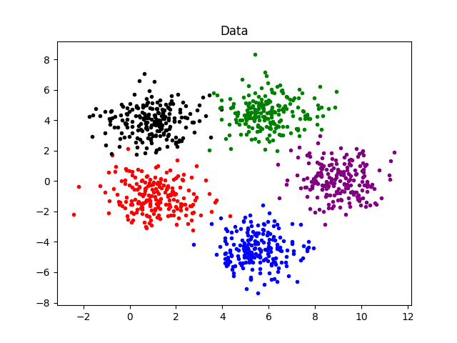

# Problem 7
## 1. 问题描述

现有1000个二维空间的数据点, 其$\sigma=[1,0;0,1]$, $\mu_1=[1,-1],\mu_2=[5.5,-4.5], \mu_3=[1,4], \mu_4=[6,4.5], \mu_5=[9,0]$.
请完成如下工作:

* 编写一个程序, 实现经典的K-means聚类算法;
* 令聚类个数为5, 采用不同的初始值观察最后的聚类中心, 给出你所估计的聚类中心, 指出每个中心有多少个样本; 指出你所得到的聚类中心与对应的真实分布的均值之间的误差(对5个聚类, 给出均方误差即可).

## 2. 实现思路

为实现上述功能, 需实现以下部分和相应功能:

* 数据生成函数: 由于实验平台为Python, 因此需根据原题中提供的Matlab代码在Python中实现相应功能. 包括: 根据已给的$\sigma$和$\mu$随机生成待聚类数据, 数据可视化和数据的储存.
* K-means聚类函数: 基于经典K-means算法, 根据输入待聚类数据, 对输入的初始化类中心迭代更新, 最终实现聚类.

## 3. Python代码
### 3.1 数据生成函数
```Python
def generate_data(save_path):
    """
    根据设定的Sigma和mu随机生成待聚类数据, 保存用于后续实验
    """
    # 设置Sigma
    sigma = np.array([[1.0, 0.0], [0.0, 1.0]])
    # 设置mu
    mu_1 = np.array([1.0, -1.0])
    mu_2 = np.array([5.5, -4.5])
    mu_3 = np.array([1.0, 4.0])
    mu_4 = np.array([6.0, 4.5])
    mu_5 = np.array([9.0, 0.0])
    # 随机生成数据
    x_1 = np.random.multivariate_normal(mu_1, sigma, 200)
    x_2 = np.random.multivariate_normal(mu_2, sigma, 200)
    x_3 = np.random.multivariate_normal(mu_3, sigma, 200)
    x_4 = np.random.multivariate_normal(mu_4, sigma, 200)
    x_5 = np.random.multivariate_normal(mu_5, sigma, 200)

    x = np.concatenate([x_1, x_2], axis=0)
    x = np.concatenate([x, x_3], axis=0)
    x = np.concatenate([x, x_4], axis=0)
    x = np.concatenate([x, x_5], axis=0)
    # 数据可视化
    plt.scatter(x_1[:,0], x_1[:,1], marker = '.',color = 'red')
    plt.scatter(x_2[:,0], x_2[:,1], marker = '.',color = 'blue')
    plt.scatter(x_3[:,0], x_3[:,1], marker = '.',color = 'black')
    plt.scatter(x_4[:,0], x_4[:,1], marker = '.',color = 'green')
    plt.scatter(x_5[:,0], x_5[:,1], marker = '.',color = 'purple')

    plt.title('Data')
    plt.savefig('data.png')
    # 数据保存
    with open(save_path, 'wb') as f:
        pickle.dump(x, f, -1)
```

### 3.2 K-means聚类函数
```Python
def k_means(data, mu):
    """
    K-means聚类
    Parameters:
        data: 待聚类数据(np.array)
        mu: 初始化聚类中心(np.array)
    Return:
        c: 聚类结果[[第一类数据], [第二类数据], ... , [第c类数据]]
        mu: 类中心结果[第一类类中心, 第二类类中心, ... , 第c类类中心]
        cnt: 迭代次数
    """
    # 待聚类数据矩阵调整(复制矩阵使其从n*d变为n*c*d, 便于后续矩阵运算)
    data = np.tile(np.expand_dims(data, axis=1), (1,mu.shape[0],1))
    # 初始化变量
    mu_temp = np.zeros_like(mu) # 保存前一次mu结果
    cnt = 0

    # 迭代更新类中心
    while  np.sum(mu - mu_temp):
        mu_temp = mu
        cnt += 1
        label = np.zeros((data.shape[0]), dtype=np.uint8)
        # mu矩阵调整(复制矩阵使其从c*d变为n*c*d, 便于后续矩阵运算)
        mu = np.tile(np.expand_dims(mu, axis=0), (data.shape[0],1,1))
        # 生成距离矩阵(n*c)
        dist = np.sum((data-mu)**2, axis=-1)
        # 初始化聚类结果 & 根据距离确定样本类别
        c = []
        for _ in range(data.shape[1]):
            c.append([])

        for idx, sample in enumerate(data):
            c[np.argmin(dist[idx])].append(sample[0])
            label[idx] = np.argmin(dist[idx])
        c = np.array(c)
        # 更新类中心
        mu = []
        for i in c: mu.append(np.mean(i, axis=0))
        mu = np.array(mu)

    return c, label, mu, cnt
```

### 3.3 实验主程序
```Python
# # 初次生成数据
# generate_data('./data')

# 加载数据
with open('./data', 'rb') as f:
    data = pickle.load(f)

# 类中心初始化
mu_1 = np.array([0.5, -4.3])
mu_2 = np.array([3.8, -6.5])
mu_3 = np.array([-3.1, 6.4])
mu_4 = np.array([0.7, 5.5])
mu_5 = np.array([1.5, 7.8])
mu_rand = np.array([mu_1, mu_2, mu_3, mu_4, mu_5])

# K-means 聚类
c, _, mu, cnt = k_means(data, mu_rand)

# 聚类结果分析 & 可视化
mu_gt = np.array([[1.0, -1.0], [5.5, -4.5], [1.0, 4.0], [6.0, 4.5], [9.0, 0.0]])

print ("共迭代了{}次".format(cnt))
E = 0
color = ['red', 'blue', 'black', 'green', 'purple']
for idx, i in enumerate(c):
    i = np.array(i)
    e = np.matmul((mu[idx]-mu_gt[idx]).T, (mu[idx]-mu_gt[idx]))
    E += e
    print ("第{}类: 初始化类中心{}, 结果为{}, 样本数为{}, 聚类中心均方误差为{}".format(idx, mu_rand[idx], mu[idx], i.shape[0], e))
    plt.scatter(i[:,0], i[:,1], marker = '.',color = color[idx])
plt.title('Data')
plt.show()
print ("聚类整体均方误差和为{}".format(E))
```

## 4. 结果与讨论

实验之前, 首先生成实验所需数据, 并存储. 其数据可视化结果如下图所示.

<div align=center>
    
</div>

利用实现的K-means对上述数据进行聚类. 多次尝试不同的初始值, 如:
* $\mu=[[3.3, -2.1],[7.6, -3.2], [0.5, 7.2], [5.4, 6.3], [13.2, -1.3]]$
* $\mu=[[-2.5, -4.1],[-1.6, 1.2], [3.4, 5.1], [1.7, 9.1], [-2.6, -3.1]$
* $\mu=[[0.5, -4.3],[3.8, -6.5], [-3.1, 6.4], [0.7, 5.5], [1.5, 7.8]$等

经观察聚类结果发现, 在本问题中, 不同初始值只会影响聚类所需的迭代次数, 如对于第一种初始值需迭代5次, 对于第三种初始值需迭代17次. 最终的聚类中心均一致.聚类所得的中心分别为:

$$
\mu_1 = [1.092081, -1.03069906]\\
\mu_2 = [5.48195172, -4.46507794]\\
\mu_3 = [0.93495792, 3.91569933]\\
\mu_4 = [5.95600064, 4.45909185]\\
\mu_5 = [9.02265324, 0.02529175]
$$

聚类结果的可视化结果如下图所示. 5个类别分别包含样本数为: 197, 201, 201, 204, 197.

<div align=center>
    
</div>

通过与真实分类情况对比, 可以发现错分点如下图所示(黄框中).

<div align=center>
    
</div>

可以看到, 被错分点由于原理真实分类的类中心, 因此从离类中心距离来看, 确实距离被错归的类中心更近, 错分情况可以理解. 5个类别的均方误差分别约为(保留5位小数): 0.00942, 0.00155, 0.01134, 0.00361 和 0.00115. 总的聚类均方误差和约为0.02707.
