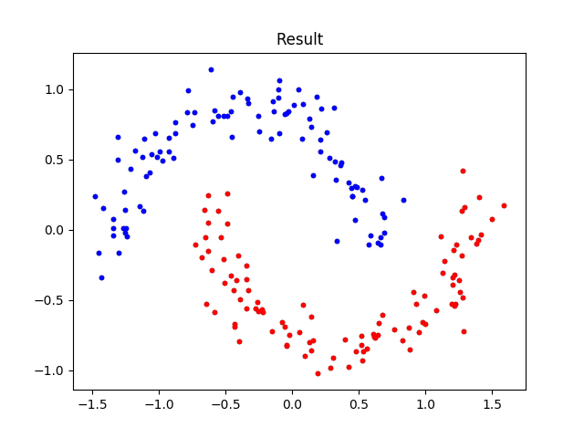
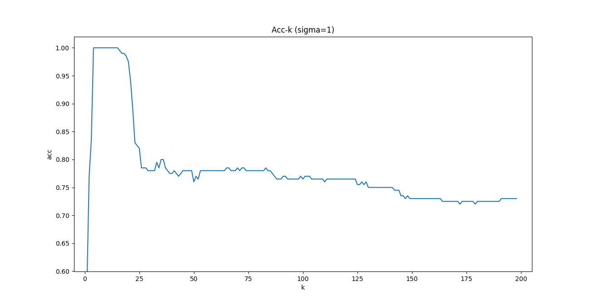
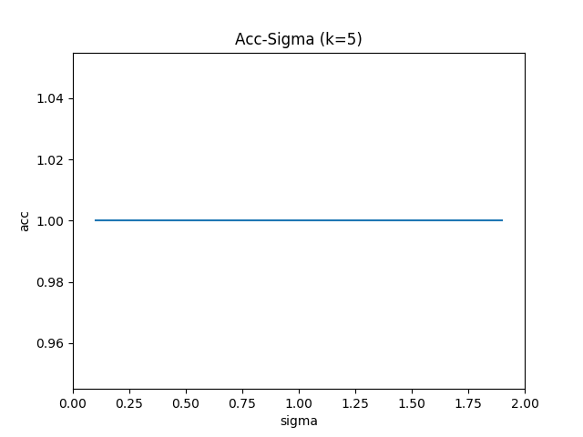
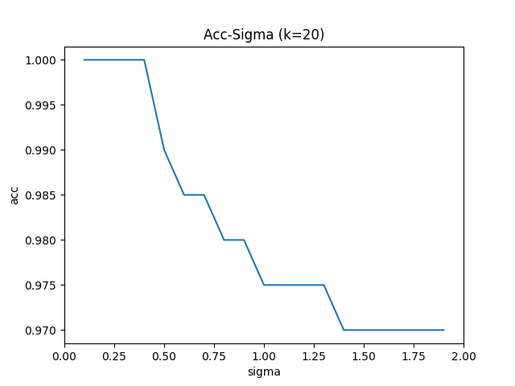
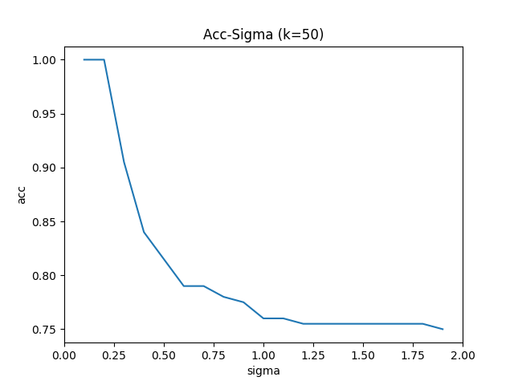

# Problem 8
## 1. 问题描述

关于谱聚类。有如下 200 个数据点,它们是通过两个半月形分布生成的。如图所示:

<div align=center>
    
</div>

* 请编写一个谱聚类算法,实现"Normalized Spectral Clustering—Algorithm 3 (Ng 算法)".
* 设点对亲和性(即边权值)采用如下计算公式:

$$
  w_{ij} = e^{-\frac{||x_i-x_j||^2_2}{2\sigma^2}}
$$

同时,数据图采用 k-近邻方法来生成(即对每个数据点$x_i$,首先在所有样本中找出不包含$x_i$的 k 个最邻近的样本点,然后$x_i$与每个邻近样本点均有一条边相连,从而完成图构造)。

注意,为了保证亲和度矩阵 W 是对称矩阵,可以令$W=\frac{(W^{T} +W)}{2}$. 假设已知前 100 个点为一个聚类, 后 100 个点为一个聚类,请分析分别取不同的$\sigma$值和 k 值对聚类结果的影响。
(本题可以给出关于聚类精度随着$\sigma$值和 k 值的变化曲线。在实验中,可以固定一个,变化另一个).

## 2. 实现思路

为实现上述功能, 需实现以下部分和相应功能:

* 数据加载函数: 从指定txt文件中读取实验数据.
* 图构造函数: 基于输入的数据和参数构造图, 图构造时首先计算每个样本点到其他样本点的距离, 利用K近邻方法生成图, 进而基于亲和性公式生成亲和性矩阵.
* 谱聚类(Ng算法)函数: 基于输入的实验数据亲和性矩阵, 依次计算D, L 和 $L_sym$, 进而求取$L_sym$的最小的前c个特征值对应的特征向量, 归一化后作为样本新特征, 利用K-means实现最终聚类.
* K-means聚类算法(上题中已实现)

## 3. Python代码
### 3.1 数据加载函数
```Python
def load_data(file_name):
    """
    加载数据
    """    
    data = []
    with open(file_name, 'r') as f:
        content = f.readlines()
        for i in content:
            i = i[:-1].split(" ")
            data.append([float(i[0]), float(i[1])])
    data = np.array(data)

    return data
```

### 3.2 图构造函数
```Python
def generate_graph(data, k, theta):
    """
    构造图
    Parameter:
        data: 待聚类数据
        k: k近邻数
        theta: 亲和性参数
    Return:
        w: 亲和性矩阵
    """
    # 构造data行列矩阵(n*n*d)以便后续矩阵运算: data_c每列相同 = data_r每行相同 = 样本数据
    data_c = np.tile(np.expand_dims(data.copy(), axis=1), (1,data.shape[0],1))
    data_r = np.tile(np.expand_dims(data.copy(), axis=0), (data.shape[0],1,1))

    # 生成Dist矩阵
    dist = np.sum((data_c - data_r)**2, axis=-1)

    # 生成W矩阵
    # 初始化w
    w = np.zeros_like(dist)
    for idx_sample, i in enumerate(dist):
        idx = np.arange(0, i.shape[0])
        # 构造 距离-索引 序列, 将距离和索引一一对应
        i_idx = zip(i, idx)
        # 按照距离递增排序
        i_sorted = sorted(i_idx, key=lambda i_idx: i_idx[0])
        # 生成w矩阵: 循环时排除自身距离为0的干扰
        for j in range(1,k+1):
            w[idx_sample, i_sorted[j][1]] = np.exp(-i_sorted[j][0]/(2*(theta**2)))
    # w调整:为保证w为对称矩阵
    w = (w.T + w)/2
    
    return w
```

### 3.3 谱聚类(Ng算法)函数
```Python
def ng_algo(W, c):
    """
    Ng谱聚类算法
    Parameters:
        W: 亲和性矩阵
        c: 聚类类别数
    Return:
        label: 聚类结果label列表 [样本1类别, 样本2类别, ... , 样本n类别]
    """
    # 计算D & D^(-1/2)矩阵: 为避免生成D后计算会出现分母为0的情况, 直接计算D^(-1/2)
    W_rowsum = np.sum(W, axis=1)
    D = np.diag(W_rowsum)
    # W_rowsum = 1/(np.sqrt(W_rowsum))
    W_rowsum = W_rowsum**(-0.5)
    D_invsqrt = np.diag(W_rowsum)
    # 计算L矩阵
    L = D - W
    # 计算L_sym矩阵
    L_sym = np.matmul(np.matmul(D_invsqrt, L), D_invsqrt)
    # L_sym特征值 & 特征向量
    e_value, e_vector = np.linalg.eig(L_sym)
    e_vector = e_vector.T
    e = zip(e_value, e_vector)
    e_sorted = sorted(e, key=lambda e: e[0])
    # 生成新特征
    new_feature = []
    for i in range(c):
        new_feature.append(e_sorted[i][1])
    new_feature = np.array(new_feature).T
    # 归一化新特征
    norm_feature = []
    for i in new_feature:
        i = i/(np.sqrt(np.sum(i**2))+1e-10)
        norm_feature.append([i[0], i[1]])
    norm_feature = np.array(norm_feature)
    # 对新特征做K-means
    mu = np.array([norm_feature[50], norm_feature[150]])
    _, label, _, _ = k_means(norm_feature, mu)
    
    return label
```

### 3.4 实验主函数
```Python
# 加载数据 & 可视化
  data = load_data("./data_2.txt")
# 构造图
k = 5
theta = 2
w = generate_graph(data, k, theta)
# 谱聚类
c = 2
label = ng_algo(w, c)
# 可视化
color = ['red', 'blue']
for idx, i in enumerate(data):
    i = np.array(i)
    plt.scatter(i[0], i[1], marker = '.',color = color[label[idx]])
plt.title('Result')
plt.show()
```

## 4. 结果与讨论

首先,测试实现的谱聚类算法的有效性. 当$k=5, \sigma=2$时, 分类完全正确, 其可视化结果如下图所示.

<div align=center>
    
</div>

然后, 探究不同的k值和$\sigma$值对聚类结果的影响. 实验时, 保持其他参数不变(固定K-means初始化值), 固定k和$\sigma$中的一个, 改变另一个, 观察聚类结果(精度)的变化.

当固定$\sigma=1$时, 如下图所示. 当$k \in (5,15)$时, 能达到$100\%$的聚类精度. 之后随着k值的增加, 聚类精度下降, 具体体现为在k=20左右时突降, 之后缓慢下降, 最终维持在0.72左右.

<div align=center>
    
</div>

在探究聚类精度与亲和性参数$\sigma$之间关系时, 由于其关系在k值不同时表现不尽相同, 故分别在k = 5, 20和50的情况下进行实验. 实验时, $\sigma \in (0,2)$, 步长0.1. 结果如下图所示.

<div align=center>
    
    
    
</div>

当固定$k=5$时,随$\sigma$变化, 聚类精度未发生变化, 恒为$100\%$. 且后续实验发现, 在$k \in (5,15)$, 均为上述现象;
当$k>15$时, 随$\sigma$增大, 聚类精度下降, 且随k值的增大, 下降速度越快.

有上述实验结果可以看出, 图的构造对谱聚类的最终结果影响很大, 只有选择合适的k近邻数和亲和性系数才能得到较好的谱聚类结果.